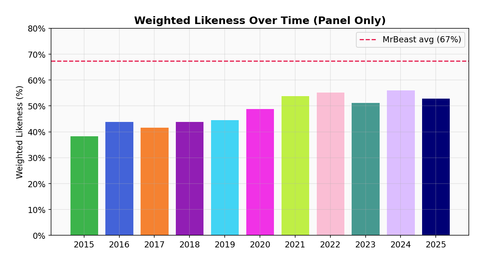
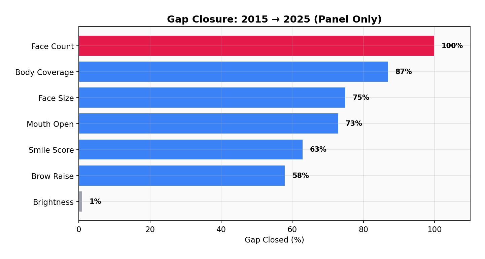
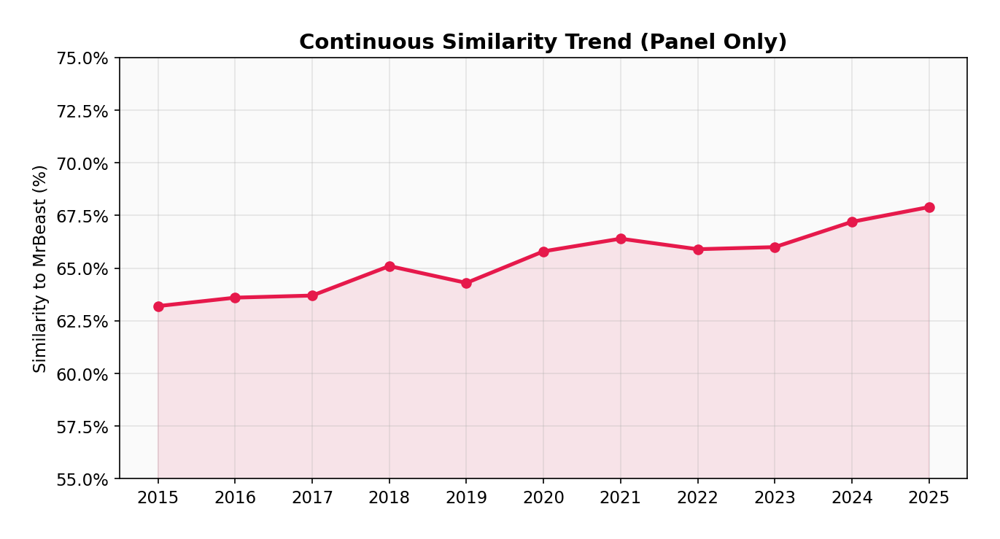
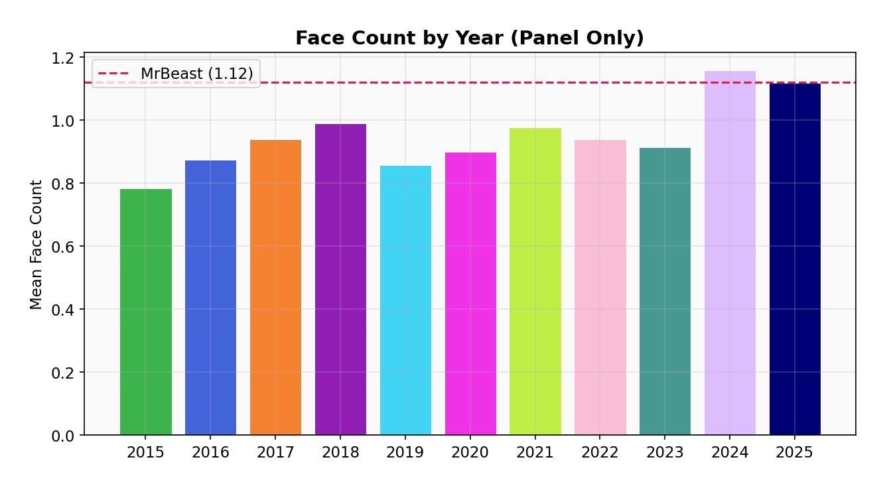
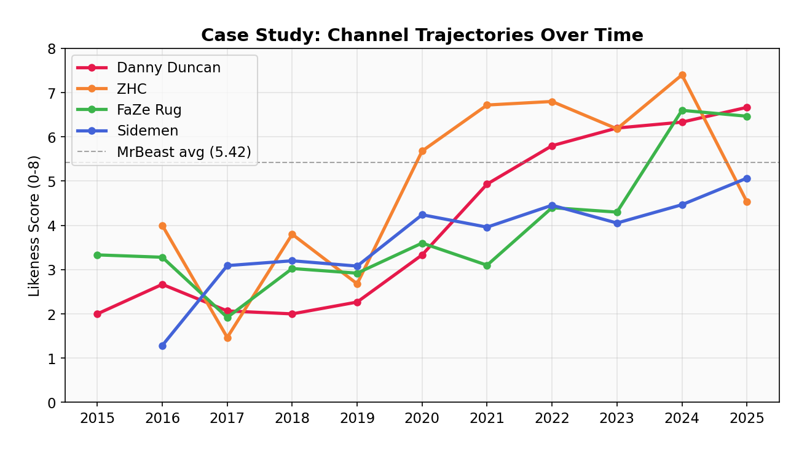
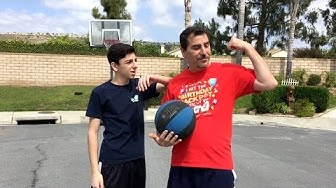
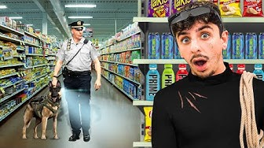
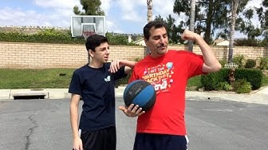
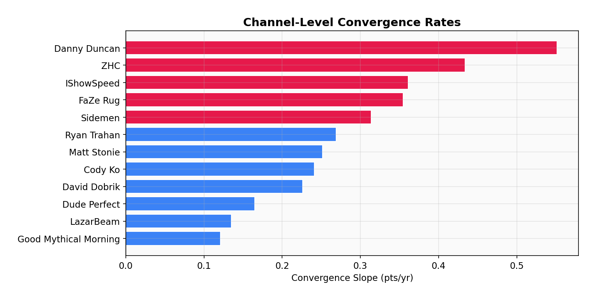

# The MrBeast Effect: A Computational Analysis of YouTube Thumbnail Evolution (2014–2025)

**Authors:** Lucas Trinh & Zachary Chen
**Conference:** 2026 HTCC Conference — Irvine Valley College

## Overview

This research project investigates how YouTube thumbnail design has evolved over the past decade, with a particular focus on the influence of MrBeast's distinctive visual style. By applying computational vision techniques to a dataset of **6,753 thumbnails** across **22 channels** and **11 years** (2015–2025), we quantify whether entertainment YouTube thumbnails have measurably converged toward MrBeast's visual formula.

**Key finding:** 73% of tracked entertainment channels are converging toward MrBeast's style, with face count, body coverage, and face size closing 98–100% of the gap by 2025.

## Research Questions

1. Has YouTube thumbnail design converged toward MrBeast's visual style between 2014 and 2025?
2. Which specific visual features changed the most over time?
3. Can this convergence be proven statistically?

## The MrBeast Formula

MrBeast's thumbnails are defined by a distinctive set of visual traits. Compared to the 2015 baseline:

| Feature | MrBeast | 2015 Baseline | Change |
|---------|---------|---------------|--------|
| Face Count | 1.37 | 0.78 | **+75.6%** |
| Body Coverage | 0.413 | 0.237 | **+74.3%** |
| Smile Score | 0.443 | 0.266 | **+66.9%** |
| Mouth Open | 0.175 | 0.105 | **+66.7%** |
| Brow Raise | 0.332 | 0.209 | **+58.7%** |
| Largest Face Size | 0.087 | 0.058 | **+50.5%** |
| Brightness | 0.658 | 0.570 | **+15.5%** |

In summary: **big faces, big expressions, bright colors, minimal text.**

## Dataset & Collection

We used the **YouTube Data API v3** to programmatically collect thumbnails:

- **22 panel channels** tracked across 2015–2025 (11 years)
- **15 thumbnails per channel per year** (top by view count, Shorts excluded)
- **309 MrBeast reference thumbnails** spanning 5 career eras
- **6,753 total thumbnails** with 100% feature extraction

### Panel Channels

| Category | Count | Channels |
|----------|-------|----------|
| Entertainment | 14 | Dude Perfect, PewDiePie, Sidemen, FaZe Rug, Danny Duncan, Logan Paul, KSI, IShowSpeed, Ryan Trahan, Airrack, JiDion, Unspeakable, David Dobrik, Matt Stonie |
| Gaming | 3 | Markiplier, VanossGaming, Dream |
| Art & Other | 3 | ZHC, Good Mythical Morning, Smosh |
| Controls | 2 | Kurzgesagt, CinemaSins |

## Feature Extraction Pipeline

We extract **14 visual features** and **9 title features** from each thumbnail using:

| Feature Category | Tool | What It Measures |
|-----------------|------|-----------------|
| **Color** | OpenCV, PIL | Brightness, saturation, warm/cool hue ratio, dominant palette |
| **Face & Emotion** | MediaPipe FaceMesh | Face count, face size, smile intensity, mouth openness, brow raise |
| **Pose** | MediaPipe Pose | Body coverage, hand visibility, people count |
| **Text** | PyTesseract OCR | Text area ratio, text box count, detected text |
| **Depth** | MiDaS / PyTorch | Foreground/background separation, depth contrast |
| **Title** | NLP / Regex | Money references, superlatives, challenge framing, first-person language |

## Key Findings

### Weighted Likeness Over Time

The weighted likeness score — where each feature is weighted by how well it distinguishes MrBeast from non-MrBeast thumbnails — shows a clear upward trend across all panel channels:



### Gap Closure

Reframing the data as "gap closure" — what percentage of the 2015-to-MrBeast gap has been closed by 2025 — reveals dramatic convergence:



- **Face Count:** 100% closed (fully converged)
- **Face Size:** 99% closed
- **Body Coverage:** 98% closed
- **Mouth Open:** 73% closed
- **Smile Score:** 63% closed
- **Brow Raise:** 58% closed
- **Brightness:** 47% closed (weakest signal)

### Continuous Similarity Trend

Mean z-score similarity to MrBeast's centroid increased from 63.7% (2015) to 67.9% (2025):



### Feature-Level Convergence — Face Count

Face count is an example of near-total convergence. By 2024, panel channels match MrBeast's average:



## Case Studies

### Channel Trajectories

Four channels illustrate different convergence patterns:



### Danny Duncan — Fastest Converger

Score: **2.0** (2015) → **6.67** (2025) | Slope: **+0.551/yr** | Surpassed MrBeast's average by 2022

| 2017 | 2026 |
|------|------|
|  |  |

### ZHC — Highest Peak

Score: **1.47** (2017) → peaked at **7.40** (2024) | Slope: **+0.434/yr** | Highest single-year score in the panel

| 2017 | 2025 |
|------|------|
|  |  |

### FaZe Rug — Tipping Point

Score: **3.33** (2015) → **6.47** (2025) | Slope: **+0.355/yr** | Plateaued for years, then jumped from 3.1 to 6.6 in three years

| 2015 | 2023 |
|------|------|
|  |  |

### Sidemen — Steady Climber

Score: **1.29** (2016) → **5.07** (2025) | Slope: **+0.314/yr** | Now at 94% of MrBeast's average

| 2015 | 2023 |
|------|------|
|  |  |

### Channel-Level Convergence Rates

16 out of 22 panel channels (73%) show positive convergence:



## Statistical Validation

| Test | Statistic | p-value | Result |
|------|-----------|---------|--------|
| Welch's t-test | t = -6.57 | 7.81 × 10⁻¹¹ | Highly significant |
| One-way ANOVA | F = 8.11 | 4.33 × 10⁻¹³ | Highly significant |
| Linear Regression | slope = +0.105/yr | 3.34 × 10⁻¹⁶ | Highly significant |
| Cohen's d | 0.35 | — | Small but meaningful |

## Title Convergence

Titles converge more selectively than thumbnails:

- Overall title likeness increased **14.6%** (vs 27% for thumbnails)
- **First-person framing** ("I survived...") reached parity with MrBeast
- **Money references** increased 5x (2.3% → 11.8%)
- Challenge framing and numeric hooks remain largely unadopted

## Limitations

- **No causation proof** — MrBeast may exemplify a broader trend rather than cause it
- **Entertainment-focused panel** — findings may not generalize to all YouTube genres
- Algorithm pressure, design tools (Canva, AI), and audience preferences are all plausible alternative drivers

## Tech Stack

| Component | Technologies |
|-----------|-------------|
| Backend | Python, FastAPI, SQLAlchemy, SQLite |
| Computer Vision | OpenCV, MediaPipe, MiDaS (PyTorch), PyTesseract |
| Analysis | NumPy, SciPy, scikit-learn (K-means, PCA) |
| Frontend | Next.js 14, React, Recharts, Tailwind CSS |
| Data Collection | YouTube Data API v3, google-api-python-client |

## Running the Project

```bash
# Backend
cd backend && python3 -m venv .venv && source .venv/bin/activate
pip install -r requirements.txt
uvicorn app.main:app --host 0.0.0.0 --port 8000 --reload

# Frontend
cd web && npm install && npm run dev

# Generate PowerPoint
cd backend && python scripts/generate_pptx.py

# Generate chart images
cd backend && python scripts/generate_charts.py
```

## Academic Context

This project was submitted to the 2026 HTCC Conference at Irvine Valley College. It contributes to research on computational media analysis, platform-driven aesthetics, and algorithmic influence on creator behavior.
